# ReefSense: see the risk before the alarm

**AI that estimates near-term coral bleaching risk for 3,780 reefs, explains every estimate, and ranks where restoration effort is most likely to last.**

Live app: [www.reefsense.online](https://www.reefsense.online) · Case study: [Crystal Bay, Nusa Penida](https://www.reefsense.online/?reef=NP01) · Code: [github.com/Tonioo125/reefcast](https://github.com/Tonioo125/reefcast)

---

## 1. Problem statement

Coral reefs bleach when the water stays too hot for too long. The world's standard warning system, NOAA Coral Reef Watch, measures this heat in **Degree Heating Weeks (DHW)**: how far the sea surface has been above the reef's usual warmest month, added up over the last 12 weeks. NOAA's bleaching alerts begin at 4 DHW (Alert Level 1).

That threshold misses most bleaching. In the 23,186 labelled dive surveys we trained on (Global Coral-Bleaching Database), only **26%** of the surveys that found significant bleaching (10% or more of colonies) had reached 4 DHW. In the Coral Triangle it was **22%**. Heat matters, but a reef's own conditions also decide when it bleaches: depth, turbidity, wave exposure and cyclone history all play a part. So most bleaching starts before the alarm sounds.

The gap hurts most where reefs matter most. Indonesia sits at the heart of the Coral Triangle, the most diverse marine region on Earth, and millions of people depend on its reefs for food, coastal protection and tourism. The teams protecting those reefs face three concrete problems:

1. **Alerts come too late.** By the time a reef reaches Alert Level 1, it may already be bleaching.
2. **Budgets are small.** Restoration takes years and every coral fragment counts. If a team restores a reef that bleaches next season, that work is lost.
3. **There is no transparent way to rank sites.** Field teams need to know *which* reefs are at risk and *why*, not a single number from a black box.

## 2. Target users

| User | Decision they make | What ReefSense gives them |
|---|---|---|
| **Reef restoration teams and NGOs** in Indonesia, e.g. coral-gardening programmes in Bali and Nusa Penida | Where to put limited restoration effort so it lasts | A ranking of reefs at low near-term risk with healthy coral, using weights they set themselves |
| **Marine protected area managers** and conservation agencies | Where to send monitoring dives when the water warms but NOAA's alerts are quiet | The **NOAA gap**: reefs below Alert Level 1 that the model still rates at elevated risk, plus each reef's 12-week heat record |
| **Reef scientists** | Whether to trust a prediction | The expert view: per-feature model contributions, nearby survey history, and published validation that includes where the model fails |
| **Divers, dive operators and coastal communities** | What is happening at the reefs they visit, and how to help | A plain-language view, links to report bleaching to citizen-science programmes, and shareable reef links |
| **Donors and the public** | Who to support | Hand-picked local conservation groups near each reef, with links to their own donation pages |

ReefSense is built for all of these, but its primary focus is the first two: practitioners who must choose sites with limited time and money. We have not run a field pilot yet (see section 5, "Path to impact").

## 3. What ReefSense does

ReefSense is a live web app. Every number on screen comes from the trained model or real data; when a source is unavailable, the app says so instead of showing a placeholder.

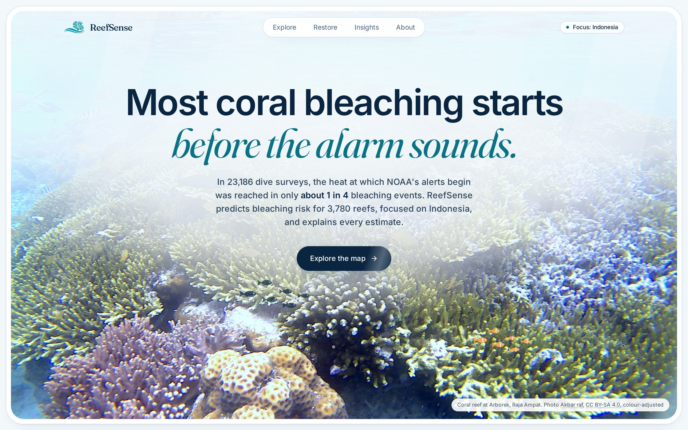

*Figure 1. The landing page leads with the problem: most bleaching starts below NOAA's alert threshold.*

**A resilience map of 3,780 reefs** (635 in Indonesia, the rest mostly across Asia). Each reef is coloured by its predicted probability of avoiding significant bleaching under its last 12 weeks of NOAA satellite heat stress. The map can be filtered by band, recoloured by coral cover, or shown over the UNEP-WCMC reef extent.

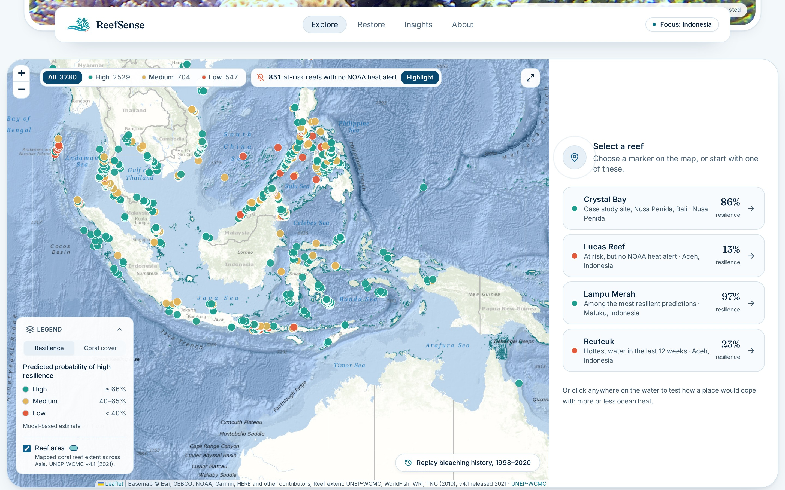

*Figure 2. The resilience map. Suggested reefs on the right open a full report.*

**The NOAA gap.** One click highlights the reefs where NOAA's alerts have not reached Alert Level 1 for 12 weeks, yet the model predicts at least a 34% chance of significant bleaching. These are the reefs a manager would not otherwise think to check.

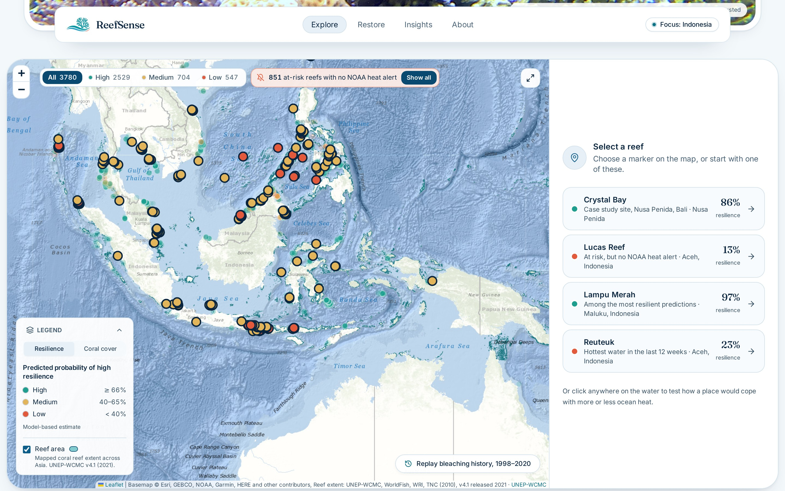

*Figure 3. The NOAA gap highlighted: at-risk reefs where NOAA's alerts stayed below Alert Level 1 for 12 weeks.*

**A report for every reef.** Opening a reef shows its estimate, the conditions behind it and everything known about the site. Our case study is Crystal Bay in Nusa Penida, Bali, where the model estimates an **86%** chance of avoiding significant bleaching under recent heat.

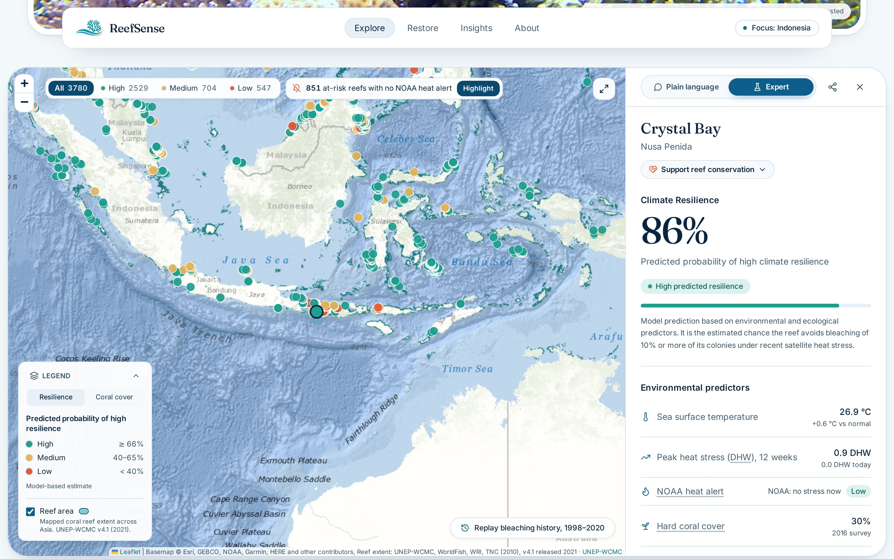

*Figure 4. The reef report: predicted probability, its band, and the environmental predictors.*

**Every estimate explains itself.** A *Plain language* view says what the estimate means in everyday words. The *Expert* view adds the 12-week satellite heat record, a **what-if slider** that re-scores the reef with the real model under more or less heat, and the model's own reasons: which factors pushed the estimate up and which pulled it down.

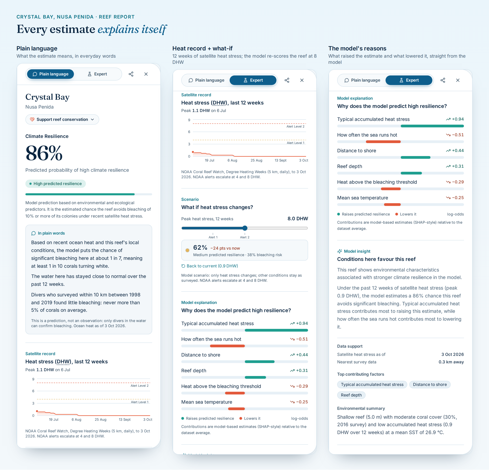

*Figure 5. Three views of the same estimate. The reasons are the trained model's per-feature contributions, not text written by a chatbot.*

**Beyond the estimate.** Each report also includes:
- **Support reef conservation:** hand-picked local organisations, such as the Coral Triangle Center (Nusa Penida MPA) and Ocean Gardener (Bali), with links to their own donation pages. ReefSense never handles money.
- **Field record and news:** past bleaching surveys within 10 km by year, and regional coral news from Mongabay.
- **Reef imagery:** a satellite view and openly licensed community photos from iNaturalist, each with its photographer and licence.

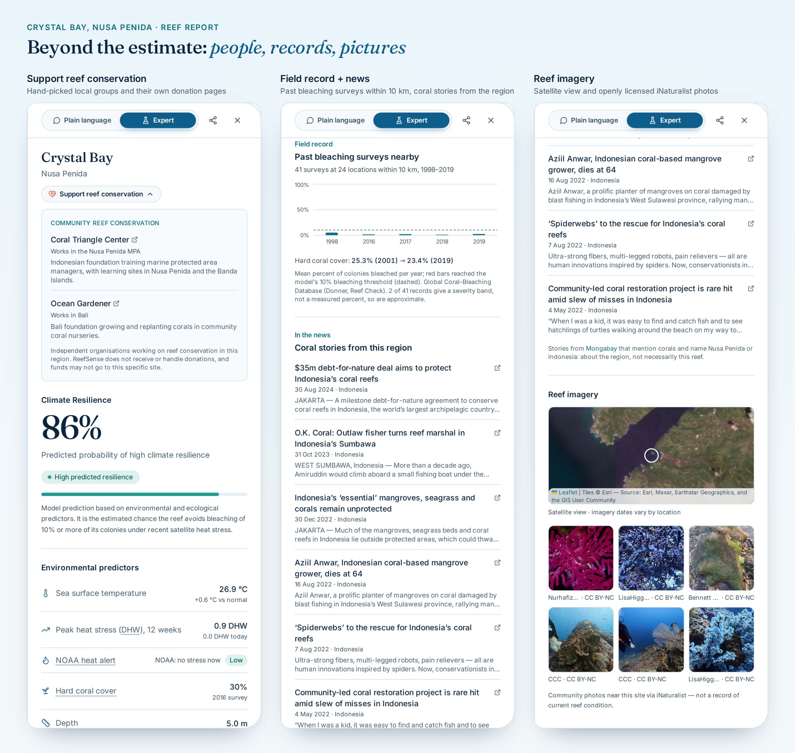

*Figure 6. The rest of the reef report: who to support, what surveys recorded, and what the reef looks like.*

**Bleaching history, 1998–2020.** A replay map shows every observed bleaching survey, year by year, including the 2016 global bleaching event.

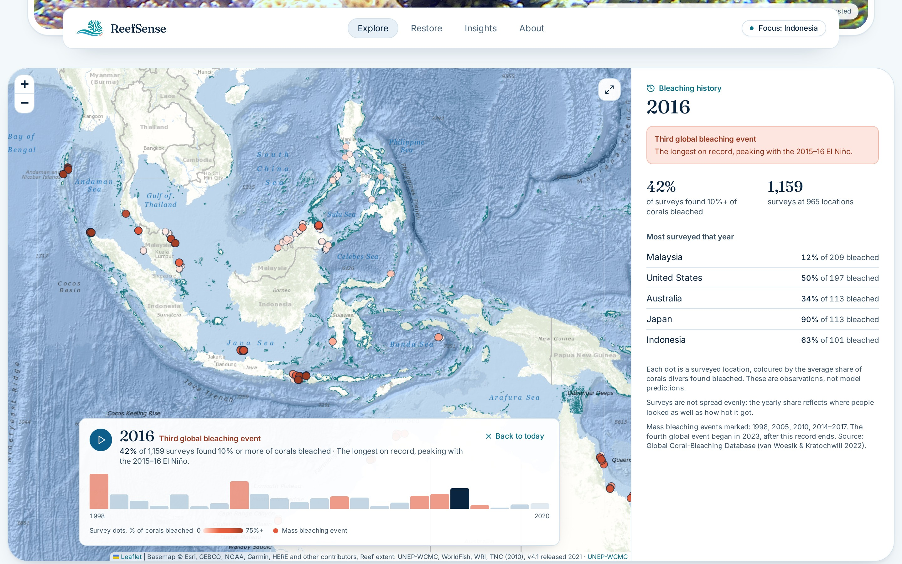

*Figure 7. The replay in 2016, during the third global bleaching event.*

**Where to restore first.** A transparent ranking for restoration teams. It combines low near-term bleaching risk with healthy coral cover from the latest dive survey within 10 km, and the user sets the weights. A reef without a survey is left out and counted, never scored on less data.

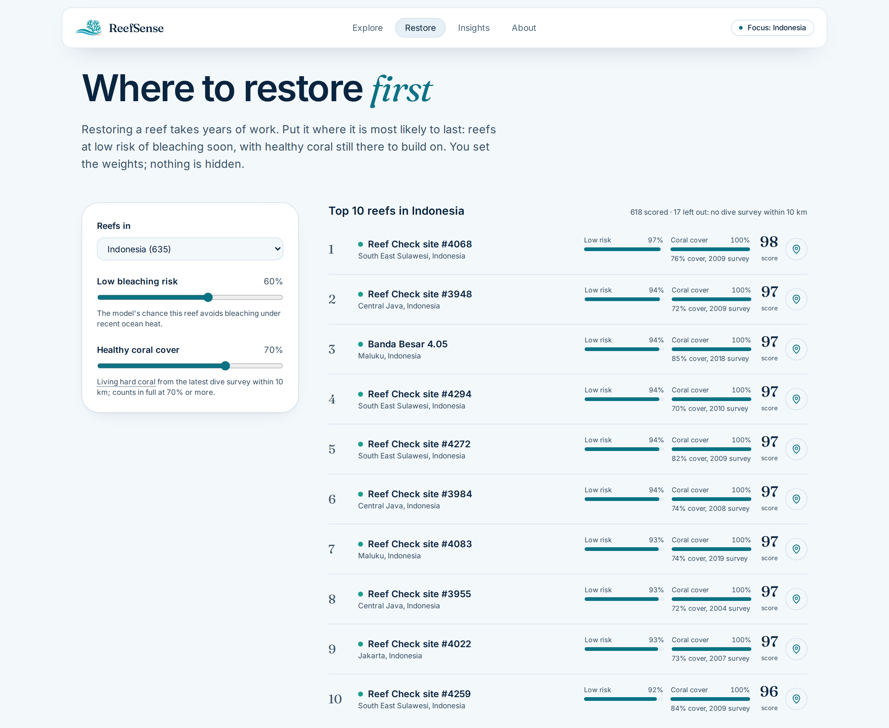

*Figure 8. "Where to restore first", with more weight on healthy coral cover. The ranking updates as the weights change.*

**What heat does to a reef.** An interactive illustration: drag the heat slider to 8 DHW and the branching corals bleach first and the fish leave; cool it down and the reef recovers. It is a picture of how bleaching spreads, not a forecast, and the page says so.

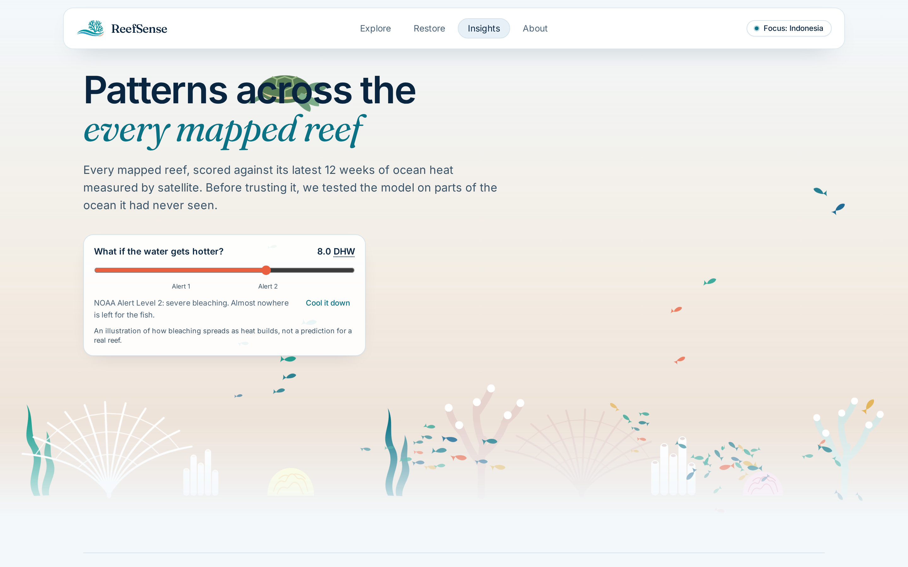

*Figure 9. The Insights section at 8 Degree Heating Weeks.*

**Tested in the open.** The site states the model's skill in one plain sentence and shows every stress test, including the one where heat alone does as well (section 4.4).

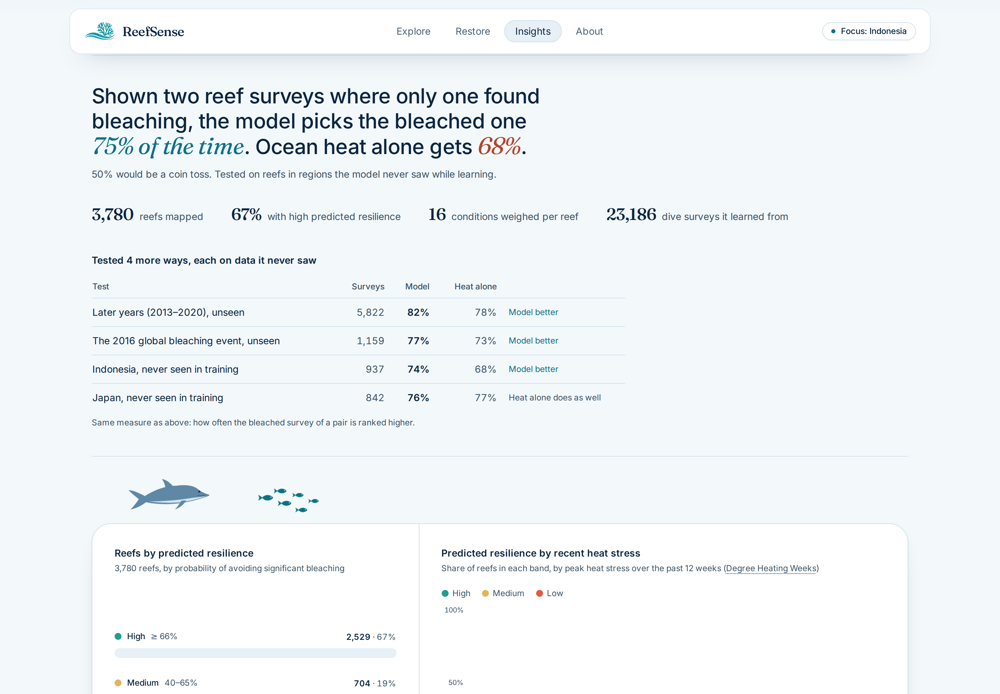

*Figure 10. Model skill and the stress-test table, as shown to every visitor.*

**What you can do.** The page ends with actions: report bleaching to CoralWatch or Reef Check Indonesia, back protected reefs, share a reef's outlook, and use the ranking to shortlist sites to check in the water.

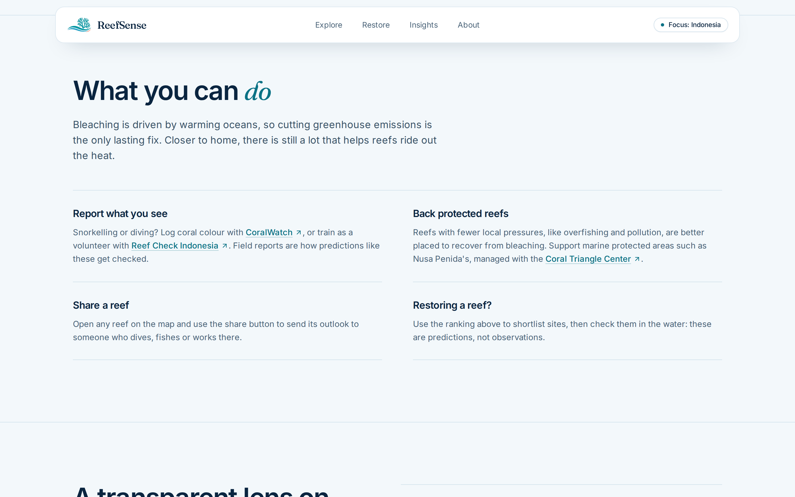

*Figure 11. The call to action.*

**On a phone.** The map and report work on a phone, where the report opens as a bottom sheet, so they can be used on a boat or at a dive centre.

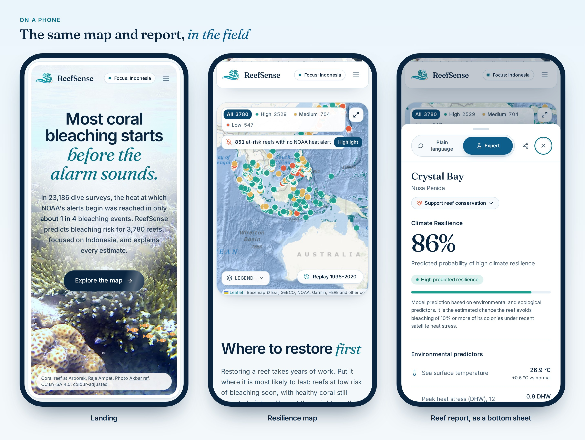

*Figure 12. The landing page, the map and a reef report on a 390 px phone screen.*

## 4. Technical approach

### 4.1 Architecture

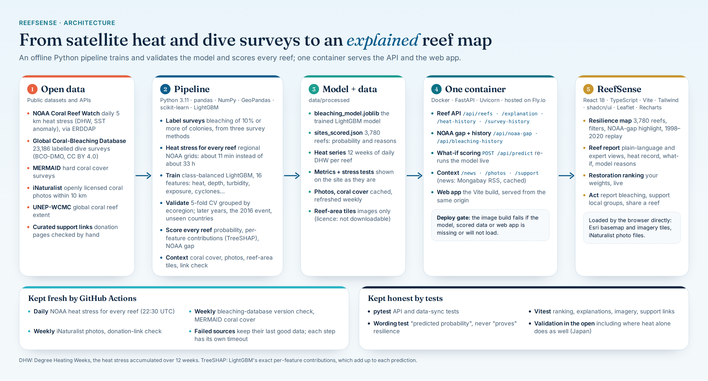

*Figure 13. Architecture: open data, an offline Python pipeline, the trained model and scored data, one container serving the API and the web app, and scheduled refreshes.*

The heavy work happens offline. A Python pipeline labels the surveys, fetches heat stress, trains and validates the model, and scores every reef, writing the results to `data/processed/`. A single Docker image then serves both the FastAPI backend and the built web app from one URL. The backend reads the scored data, and it keeps the trained model loaded for one job: the what-if slider, which re-scores a reef live under a different heat level.

### 4.2 Data

| Source | Used for |
|---|---|
| **Global Coral-Bleaching Database** (van Woesik & Kratochwill 2022, CC BY 4.0) | Training labels and site conditions: 23,186 surveys, 27.8% bleached |
| **NOAA Coral Reef Watch** v3.1, daily 5 km (ERDDAP) | Live heat stress: DHW, SST anomaly, alert levels |
| **MERMAID** | Hard coral cover for the ranking |
| **iNaturalist** API | Openly licensed coral photos within 10 km |
| **UNEP-WCMC** coral reef extent v4.1 | Reef-area map layer (served as image tiles, as its licence requires) |
| **Mongabay** | Regional coral news |
| **Esri** World Imagery and Ocean basemaps | Map and satellite tiles |

**Labels.** A survey counts as bleached when 10% or more of colonies bleached. The database mixes three survey methods, so each survey's percentage comes, in order of preference, from the recorded percent of colonies bleached (8,947 surveys), the mean of Reef Check's four transect segments (11,297), or the midpoint of a coarse severity code (2,942).

**Heat stress at scale.** Fetching NOAA data one reef at a time would take about 33 hours for 3,756 surveyed reefs. Instead, the pipeline downloads regional grids and samples every reef from them, in about 11 minutes. Coastal reefs whose 5 km pixel is masked as land take the nearest ocean pixel within 0.25°.

### 4.3 Model and explanations

The model is a class-balanced **LightGBM** gradient-boosted classifier over 16 features. Ten describe heat: accumulated DHW (current, maximum and mean), SST anomaly and its DHW, thermal stress anomaly, how often each happens, the climatological SST, and mean temperature. Six describe the reef itself: turbidity, depth, distance to shore, wave exposure, cyclone frequency and wind speed.

For each reef it predicts the probability of bleaching of 10% or more of colonies under the last 12 weeks of heat. ReefSense shows the complement, the *predicted probability of high climate resilience*, and bands it as high (66% or more), medium (40–66%) or low (under 40%).

Explanations come from LightGBM's exact per-feature contributions (TreeSHAP). They are in log-odds and add up exactly to each prediction:

> log-odds(bleaching) = baseline + contribution(feature 1) + … + contribution(feature 16)

So each "reason" on screen is a number the model itself computed for that reef. A short sentence names the factor that raised the estimate most and the one that lowered it most.

### 4.4 Validation

A random train/test split would leak information between neighbouring reefs and overstate skill. So we validate with **5-fold cross-validation grouped by ecoregion**: each fold is tested on places the model never saw. We then stress-test it on later years, a global bleaching event and whole countries held out of training, always against heat alone (DHW) on the same surveys.

We report ROC AUC, which has a plain meaning: shown one survey that bleached and one that did not, how often does the model rank the bleached one higher? 50% is a coin toss.

| Test (never seen in training) | Surveys | ReefSense | Heat alone |
|---|---|---|---|
| Ecoregions, 5-fold grouped CV | 23,186 | **0.754** | 0.677 |
| Later years: train to 2012, test 2013–2020 | 5,822 | **0.822** | 0.778 |
| The 2016 global bleaching event | 1,159 | **0.771** | 0.726 |
| Indonesia held out | 937 | **0.744** | 0.680 |
| Japan held out | 842 | 0.759 | **0.767** |

The model beats heat alone on new places, later years, the 2016 event and an unseen Indonesia. In Japan, heat alone does as well. We checked whether one feature (cyclone frequency) was standing in for "Japan": removing it barely changes the results (0.763 vs 0.754 cross-validated), so the Japan row stays in the table, on the site and here.

### 4.5 Restoration ranking

For the reefs in scope (Indonesia by default), each reef's score is a weighted average of two criteria, each on a 0 to 1 scale:

> score = 100 × (w_risk × resilience + w_cover × min(coral cover ÷ 70%, 1)) ÷ (w_risk + w_cover)

Resilience is the model's probability of avoiding bleaching. Coral cover comes from the latest dive survey within 10 km and counts in full at 70% or more. The weights are sliders. A reef missing a weighted criterion is excluded and counted on screen, rather than scored on what is left. The method also supports climate refugia (50 Reefs+) and larval connectivity, which we will add once their data is loaded rather than approximate them.

### 4.6 Application, infrastructure and quality

- **Backend:** FastAPI on Uvicorn. Endpoints for reefs, explanations, the 12-week heat history, nearby survey history, news, photos, support links, the NOAA gap, the bleaching-history replay, model metrics, and `POST /api/predict` for what-if scenarios. Results are cached in memory until their files change.
- **Frontend:** React 18 and TypeScript on Vite, styled with Tailwind CSS and shadcn/ui, with React Leaflet maps and Recharts charts. It works on desktop and phone, supports the keyboard, and respects reduced-motion settings.
- **Deployment:** a two-stage Docker image (Node build, then Python runtime) on **Fly.io**. The image build runs a check that fails if the model, the scored data or the web app is missing or will not load, so a broken build never reaches the live site. Model library versions are pinned to the ones it was trained with.
- **Automation:** a GitHub Actions workflow refreshes NOAA heat stress daily, and runs a database version check, coral cover, photos and a donation-link check weekly. Each source has its own timeout, and a failed source keeps its last good data.
- **Tests:** pytest for the API and the data sync, and Vitest for the ranking, explanations, imagery and support links. One test enforces the scientific wording: values are a "predicted probability of high climate resilience", never a "resilience score", and the app never says the model "proves" anything.

### 4.7 Technical components

| Layer | Components |
|---|---|
| Data and ML | Python 3.11, pandas, NumPy, GeoPandas, scikit-learn, LightGBM, joblib |
| Explainability | LightGBM per-feature contributions (TreeSHAP) |
| API | FastAPI, Uvicorn, requests |
| Web app | React 18, TypeScript, Vite, Tailwind CSS, shadcn/ui, React Leaflet, Recharts, Lucide |
| Maps and data services | NOAA Coral Reef Watch (ERDDAP), Esri tiles, iNaturalist, MERMAID, Mongabay RSS, UNEP-WCMC |
| Infrastructure | Docker, Fly.io, GitHub Actions |
| Testing | pytest, Vitest |

## 5. Real-world impact

**How ReefSense changes decisions**

1. **It moves the warning earlier.** Most bleaching happens below the alert threshold, so a manager relying on alerts alone checks reefs too late. The NOAA-gap view gives a ranked shortlist of reefs to dive *now*, while heat is still building. Catching bleaching early matters: it is when managers can reduce other stresses, such as pausing tourism or fishing pressure at a site, or move coral nursery stock.
2. **It puts restoration where it is most likely to last.** A coral nursery or restoration site is years of work. Ranking reefs by low near-term risk and healthy existing coral steers that work away from sites likely to bleach next season. The weights are open, so a team can argue about them instead of trusting a black box.
3. **It makes AI trustworthy enough to act on.** Every estimate carries its reasons, its heat record and the nearby survey evidence, and the validation is public, including its weak spot. That is what a scientist or a manager needs before acting on a prediction.
4. **It turns visitors into helpers.** Divers and communities are pointed to CoralWatch and Reef Check Indonesia to report what they see, which adds field data. Donors are pointed to vetted local groups working near the reef they care about.

**Why it can scale**

- **It costs almost nothing to run.** Every input is free, public data. The whole app runs in one small container, and scheduled jobs keep the data fresh without anyone maintaining it.
- **It is not tied to one country.** The model learned from surveys across the world's oceans, and covering a new region means adding its surveyed reefs and fetching their heat grids. Indonesia is the focus because that is where the gap between alerts and bleaching costs the most.
- **It is honest about its limits,** so users know when to rely on it. The estimate is near-term resistance under recent heat, not a long-term projection; 5 km satellite pixels average over individual reefs; and the ranking supports field assessment, it does not replace it.

**Path to impact, and how we would measure it**

We have no partners or users yet, and we do not claim any. Next steps:
1. Share ReefSense with restoration and MPA teams working in Nusa Penida (for example the Coral Triangle Center) and ask whether the ranking would change how they choose sites.
2. Measure **field verification**: of the reefs in the NOAA gap that teams survey, how many show bleaching?
3. Measure **restoration outcomes**: over the following seasons, how do sites chosen with the ranking survive compared with others?
4. Add climate refugia and connectivity to the ranking, and an Indonesian-language version for local teams.

## Data sources and credits

NOAA Coral Reef Watch (public domain) · Global Coral-Bleaching Database, van Woesik & Kratochwill (2022), CC BY 4.0 · MERMAID · iNaturalist community photos, credited with each photographer and licence (CC BY-NC shown here) · UNEP-WCMC Global Distribution of Coral Reefs v4.1 · Basemap and imagery © Esri · Regional news from Mongabay · Landing-page photo: coral reef at Arborek, Raja Ampat, by Akbar raf (Wikimedia Commons), CC BY-SA 4.0.
